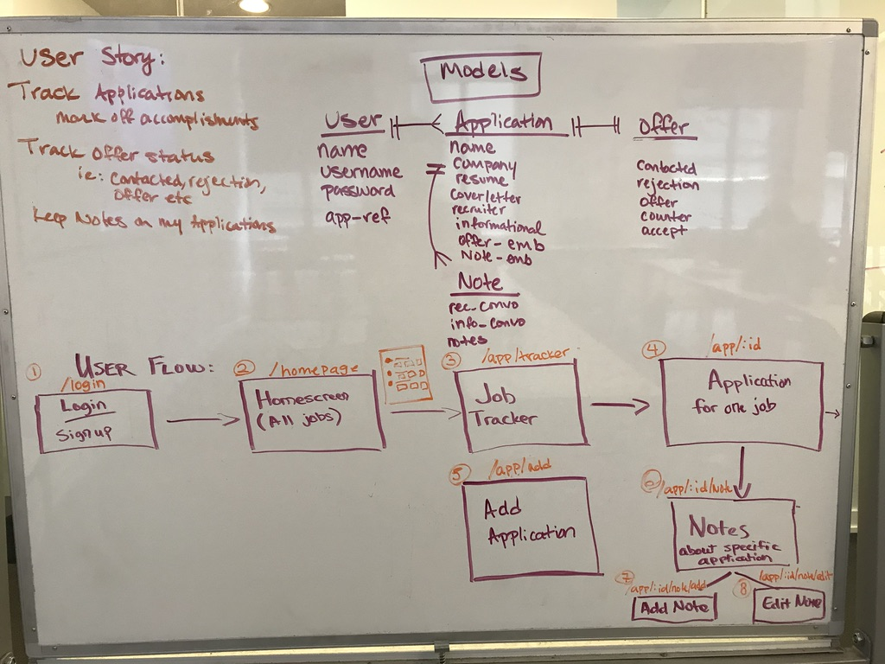
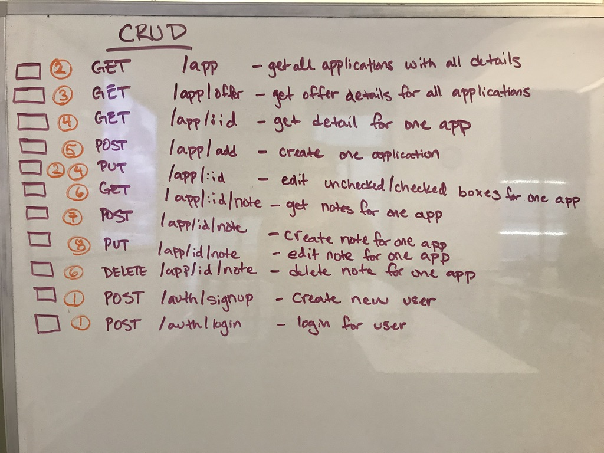
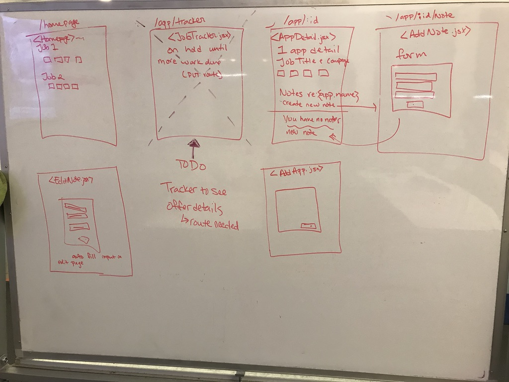

# JobTrackers - Unit 4 - GA

# Link to HEROKU Deployment:

## What is JobTrackers
JobTrackers allows a job seeker to organize their job search in one convenient place. It is designed, developed, and deployed as a full-stack MERN Web App from 2 Sofware Engineering Immersive students in Seattle, WA.

## Team Members

* Ari Greif (Git Master)
* Josh Hunter

## Foundation

JobTrackers is built with React, Node, Express, and MongoDB. It features React Hooks and it incorporates API Axios fetches, CRUD methods, and RESTful routing best practices.

## User Experience, wireframing, project flow

We agreed that our users who need to organize their job search would want the ability to: 
* Signup/Login
* Add a new job they are interested in
* Indicate whether they have submitted an app, included a resume, attached a cover letter, contacted a recruiter, and conducted an introductory interview
* Upon submission, the user sees and updates their progress through the job search
* That data persists throughout the app and renders onto the profile page into an appealing and organized format.


Our project began with some initial User Flow, User Experience, and Whiteboard planning



And throughout the planning process, we trimmed the unnecessary routes and settled on a gameplan:




## Development Log

* 5-day timeframe from project launch to deployment. 

We spent first days planning. This included whiteboarding, developing schemas for Mongoose, deciding which elements of React we wanted to feature(hooks), and CRUD routing.  We worked together to compile the api server. See photos above to observe the process.

Below is the code implementation of routes:
## API - ROUTES
* Get All Apps for a user
```
// GET /api/apps - Show all applications for a user 
router.get('/apps', (req, res) => {
  User.findById(req.user._id).populate('applications').exec((err, user) => {
    res.json(user.applications)
  })
})
```
* Get One App
```
// GET /api/apps/:id - Show details of one application 
router.get('/apps/:id', (req, res) => {
  User.findById(req.user._id).populate('applications').exec((err, user) => {
    Applications.findById(req.params.id, (err, application) => {
      res.json(application)
    })
  })
})
```
* Post a new app
```
// POST /api/apps - Create a new application for a user 
router.post('/apps', (req, res) => {
  User.findById(req.user._id, (err, user) => {
    // Create an application
    Applications.create({
      name: req.body.name,
      company: req.body.company,
      resume: false,
      coverLetter: false,
      recruiter: false,
      informational: false,
    }, (err, application) => {
      // Save the application so that it gets an ID
      application.save((err, newApplication) => {
        // Push that application into the User.applications array
        user.applications.push(newApplication)
        // console.log(`🐙`,user)
        user.save((err, updatedUser) => {
          res.json(updatedUser)
          console.log(`🐸`, updatedUser)
        });
      });
    });
    }).catch(err => console.log(`🚨`, err))
  })
```

* Update an existing App
```
// PUT /api/apps/:id - Edit unchecked/checked boxes for one app
router.put('/apps/:aId', (req, res) => {
  console.log('I"M HERE----------------------------------------------------------')
  Applications.findById(req.params.aId, (err, application) => {
    application.set(req.body);
    console.log(`🐳`,application)
    application.save((err, newApp) => {
      res.json(newApp)
    })
  })
})
```

* Post a NOTE to an existing app
```
// POST /api/apps/:id/note - Create a note for one application 
router.post('/apps/:id/note', (req, res) => {
  User.findById(req.user._id, (err, user) => {
    Applications.findById(req.params.id, (err, application) => {
      console.log(application)
      //Create note
      note = {
        rec_convo: req.body.rec_convo,
        info_convo: req.body.info_convo,
        comments: req.body.comments,
      }
      //push note into app
      application.notes.push(note);
      //Save app
      application.save((err, newApplication) => {
        res.json(newApplication)
      })
    })
  })
})
```

* Update a note to an app
```
// PUT /api/apps/:appId/note/:nId - Edit note for one app 
router.put('/apps/:appId/note/:nId', (req, res) =>{
  Applications.findById(req.params.appId, (err, application) => {
    let note = application.notes.id(req.params.nId)
    console.log(note)
    note.set({
      rec_convo: req.body.rec_convo,
      info_convo: req.body.info_convo,
      comments: req.body.comments
    })
    application.save()
    res.send(application)
  })
})
```

* Delete an app
```
// DELETE /api/apps/:id - delete one app
router.delete('/apps/:aId', (req, res) => {
  console.log(`We want to DESTROY A JOB`)
  Applications.findByIdAndDelete(req.params.aId, req.body, (err, application) => {
    console.log(`Are you gone yet?`, application)
    res.json(application);
  })
})
```

* Pivot Day - Of most importance was getting the bearer token to pass through successfully into separate components, without it, we were struggling to gain quick traction on our React pages. Also, we implemented a string of Boolean conditions into the relationship models, rigged them with checkboxes so the user could toggle between checkmarks... This proved harder to implement than originally planned. It took some strategizing, refactoring, and consulting with other developers. Mission Accomplished however. With the completion of those bullets, we now sit at 80 % MVP

* Final Day - Debugging, Troubleshooting, and Redirect Links have been fleshed out after rigorous state handling changes and route path adjustments were needed. Different background image that worked better than first iterations.

# New Things Learned
To address issues with the bearer token, we learned about props.location.token.
Documentation support can be found at:
[https://github.com/ReactTraining/react-router/blob/master/packages/react-router/docs/api/location.md]

To address issues with Redirect, Documentation can be found at:
[https://github.com/ReactTraining/react-router/blob/master/packages/react-router/docs/api/Redirect.md]

To address issues with useState and useEffects hooks, we learned through MUCH trial and error.

At our final Day, here is a brief tour of our App:
THE WELCOME PAGE: [picture](img/WelcomePage.png)

ALL THE JOBS YOU WANT TO TRACK: 
[picture](img/Jobs.png)

WHAT BOXES CAN YOU CHECK OFF: 
[picture](img/Tour.png)

EDIT THEM AS YOU DESIRE: 
[picture](img/Checkboxes.png)

WHAT NOTES WOULD YOU LIKE TO ADD: 
[picture](img/Notes.png)


# Acknowledgements
Special thank you to:
* Steve Peters - SEI Instructor
* Sarah King - SEI Instructor
